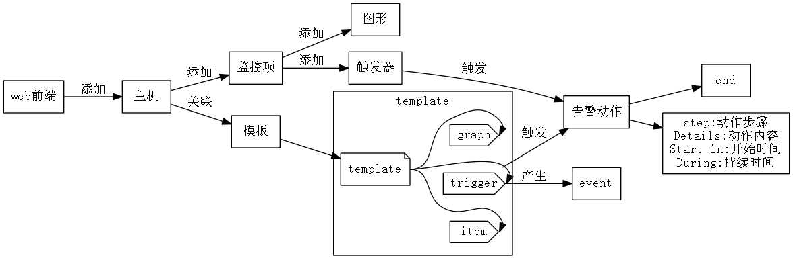
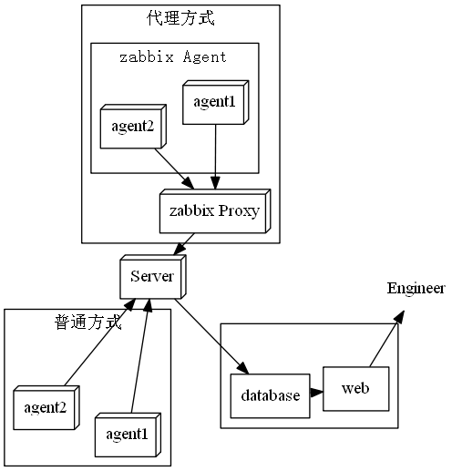
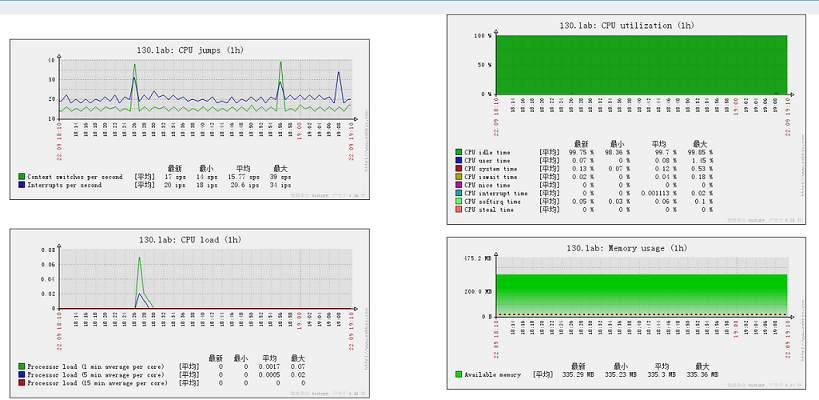

% zabbix 串讲
% me@annhe.net
% 2015.9.23

## 概述

1. 开源的，高度集成的分布式监控解决方案
2. 通过C/S模式采集数据，B/S模式在web端展示和配置
	* Client：主机通过安装agent方式采集数据，网络设备通过SNMP方式采集数据  
	* Server：收集agent和SNMP发送的数据并写入数据库（MySQL等），在通过php前端在web上展示
3. 监控的意义
	* 及时处理故障
	* 为容量规划提供数据支持

### zabbix术语

| ------- | ------ |
| 监控项(item)|监控的基本元素，每个监控项对应一个被监控端的采集值 |
| 应用集(application)|监控项的逻辑组 |
| 触发器(trigger)|通过计算item数据值来判断主机状态(OK/Problem) |
| 图形(graph)|为item数据提供可视化的展示 |
| 主机(host)|一个你想监控的网络设备(需要知道IP/DNS) |
| 主机群组(host group)|主机的逻辑组 |
| 模板(Template)|可以被主机套用的item，trigger，graph等的集合 |
| 媒介(media)|发送告警的渠道(sms/email等) |
| 告警(notification)|通过媒介(media)渠道发送事件的消息 |
| 告警动作(action)|当触发器条件被满足时，执行指定的告警动作 |

### zabbix处理流程	
	


### zabbix部署方式



## 触发器
触发器表达式

```
{<server>:<key>.<function>(<parameter>)}<operator><constant>
```

触发器实例

```
负载高
{host:system.cpu.load[all,avg1].last()}>5

服务器过载
{host:system.cpu.load[all,avg1].last()}>5|{host:system.cpu.load[all,avg1].min(10m)}>2

/etc/passwd文件被修改
{host:vfs.file.cksum[/etc/passwd].diff()}=1

服务器不可达（最近30分钟内超过5次不可达）
{host:icmpping.count(30m,0)}>5
```

## 主机监控实例

添加对131.lab 80端口的监控

路径：Configuration -> Hosts -> Create Host

```
Hostname: 允许英文字母，数字，下划线，空格，破折号，点。不允许使用中文
	注意：agent需要向server发送数据时，此处填写的必须和agent配置文件中的Hostname值一致
Visible name: 可以使用中文
Group: 必选，至少一个主机组
Agent interfaces: 填写agent的IP或者主机名，写主机名后面需要选DNS，并且该主机名应该是可以被解析的
```

添加item，接上面的步骤，item -> create item

```
type: zabbix agent
key: net.tcp.listen[80]
Type of information: 字符型
```

添加trigger

接上面的步骤，trigger -> create trigger

```
Name： 自定义
表达式： {131.lab-2:net.tcp.listen[80].last(#1)}=0
Severity： 严重性，根据需要选择
```

添加告警动作

告警策略：如果80端口不通，则

```
1. 立即给管理员发送1封邮件
2. 如果5分钟内还未得到解决，在每隔3分钟发1封邮件，发4封
```

Configuration -> Action -> 右上角Event Source选 Trigger

```
action定义告警内容
condition定义告警条件，可以根据主机组，触发器严重性等报警
operation告警动作，step是步骤，编辑：

step from to： 指步骤起始结束，如果为0，则无限告警，直道监控项恢复正常
Step duration： step间隔
```

如图：


应用模板

模板(Template)：
	* 将item，trigger，graph，screen等汇总为模板
	* 模板直接链接到一类主机，实现批量定义
	* 修改模板可以使关联到模板上的主机全部被修改

编辑主机131.lab，切换到Templates，select一个或多个template

Configuration -> Templates 中可以添加或修改模板

## Low-level discovery和item prototype

本节关注自动发现(Low-level discovery)中的外部检查(external check)和项目原型(item prototype)中的zabbix捕捉器，外部检查获取api列表，主要用于基于prototype自动生成具体的监控项、触发器、图形等

外部检查脚本要求返回一个json格式的数据，形式如下：

```
{
	data: [
		{"{#NAME}", "value"},
		{"{#NAME}", "value"},
		...
	]
}

```

一个简单的例子，监控几个url完成访问请求所用的时间

```
# zabbix_server.conf配置externalscripts路径
[root@repo externalscripts]# cat /usr/local/zabbix/etc/zabbix_server.conf |grep "^ExternalS"
ExternalScripts=/usr/local/zabbix/share/zabbix/externalscripts

# 数据文件格式，一行一个主机
[root@repo externalscripts]# cat list.txt 
baidu.com
www.sina.com
repo.annhe.net
```

在externalscript目录下编辑脚本 `curl.sh`：

```
#!/bin/bash
file="/usr/local/zabbix/share/zabbix/externalscripts/list.txt"
str="{\"data\" : ["
while read url;do
	str=$str"{\"{#URL}\" : \"$url\"},"
done <$file

str=`echo $str |sed 's/,$//g'`
str=$str"]}"
echo "$str"
```

脚本返回结果：

```
[root@repo externalscripts]# ./curl.sh 
{"data" : [{"{#URL}" : "baidu.com"},{"{#URL}" : "www.sina.com"},{"{#URL}" : "repo.annhe.net"}]}
```


web界面配置步骤

```
1. web界面添加一个主机 (主机名url.curl)，类型为 外部检查 ，key为 curl.sh
2. 添加 item prototype，类型为zabbix trapper，键值自定义，参数要引用外部检查脚本中
   定义的宏(本例为 {#URL})，例如 web_api[{#URL}]
3. 客户端zabbix_sender 发送item数据，发送数据脚本 url_cron.sh：

#!/bin/bash
file="/usr/local/zabbix/share/zabbix/externalscripts/list.txt"
while read url;do
	code=`curl -s -w %{time_total} http://$url -o /dev/null`
	zabbix_sender -z repo.annhe.net -s url.curl -k web_api[$url] -o "$code" -r
done <$file
```

每10秒发送一次

```
nohup watch -n 10 ./url_cron.sh &>/dev/null &
```

# Low-level discovery和item prototype - 续4

查看数据


## zabbix整合item

整合item用于计算（平均值，总和等）主机群组内全部主机的情况


```
#聚合检查不需要在被监控主机上运行任何代理程序。Zabbix服务器直接通过数据库查询来收集聚合信息
grpfunc[<group>,<key>,<func>,<param>]	
```

添加对Linux Server组平均负载情况的统计

```
1. Configuration -> Hosts -> Create Host
2. 主机名 appregate.linux.server, 群组必选, 其他的随意
3. item -> create item, 类型选 zabbix aggregate, 键值填 grpavg["Linux servers","system.cpu.load[percpu,avg1]",last,0]
4. 数据类型选 浮点型
5. Graph -> create graph, 添加刚才设置的item
```

Monitoring -> Graph 右上角筛选查看效果图


## Screen
将同一主机或类型的数据放到一个屏幕来展示

Configuration -> Screen -> create screen

